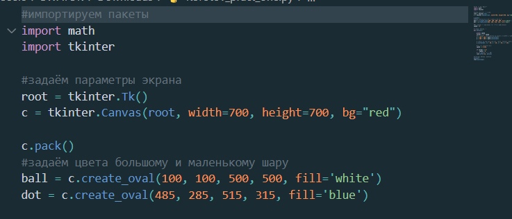

# Практическая работа номер 5. 
## Работу выполнил - Коротов Денис Игоревич, студент группы ПИ20-6
### Знакомство с Ткинтер
_______
**Главное:** 
- Импортируем библиотеки, задаём парметры фигур, их цвет, место.

 
_______
- Создаём функцию со координатами по косинусу и синусу полёта фигуры и её форме. И вызываем её.

